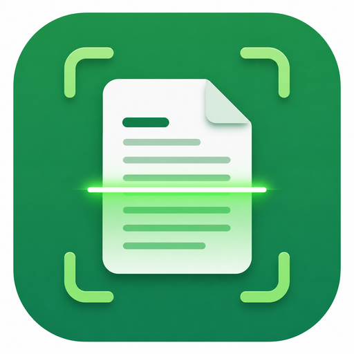
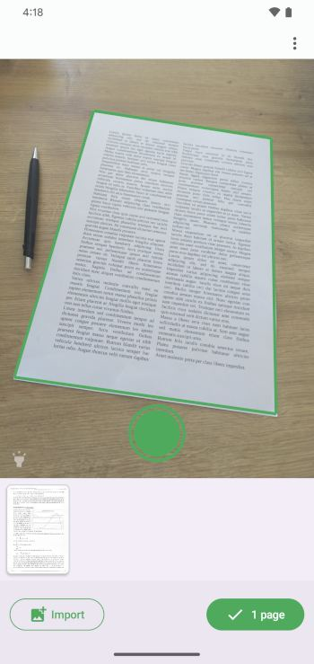
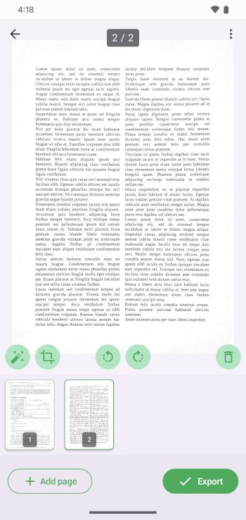
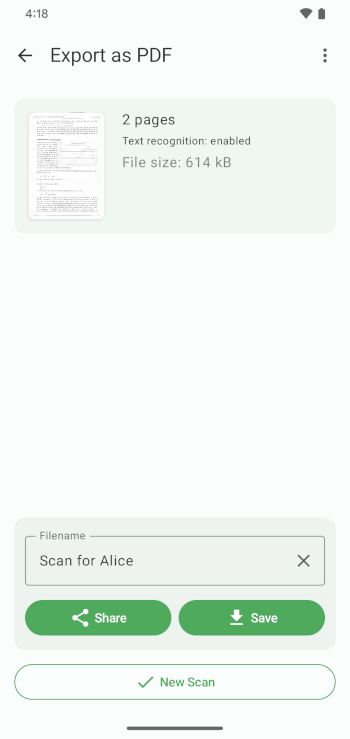

<p align="center">
  
</p>

<h1 align="center">DocSScaner</h1>

<p align="center">
  An Android app to scan your documents —
<br/><b>simple</b> and <b>respectful</b>.
</p>

<p align="center">Version 1.0 · Developed by <b>Alkatrazer</b></p>
<p align="center">Based on <a href="https://github.com/pynicolas/FairScan">FairScan</a>.</p>
<p align="center">Source code for the RuStore version: <a href="https://github.com/gholiankin2002-droid/DocSScaner">github.com/gholiankin2002-droid/DocSScaner</a>.</p>

---

DocSScaner is an Android app to **scan documents quickly, easily and privately**.

It's designed to be **simple**: users get a clean, shareable PDF in seconds, with no manual adjustments.<br>
And **respectful**: open source, minimal permissions, no tracking, no ads.

- Contact: profcapper@gmail.com

---

## Contributing

Contributions are welcome, but please read the guidelines first: [CONTRIBUTING.md](CONTRIBUTING.md)

---

## Screenshots

| Scan | Preview | Save & Share |
|------|---------|--------------|
|  |  |  |

---

## Features

- **Clear, distraction-free interface**
- **Easy flow**: scan, review if needed, save or share
- **Automatic document detection** using a custom segmentation model
- **Automatic perspective correction**
- **Automatic image enhancement**
- **Fast PDF generation** with no manual adjustments
- **All document processing happens locally on your device**, no cloud processing
- **Minimal permissions**
- **Open source**, GPLv3

---

## What DocSScaner is not

DocSScaner is **not** intended to:
- provide fine-grained manual control over document processing
- replicate all features found in other scanning apps
- optimize for highly specific use cases at the expense of simplicity
 
---

## Compatibility

DocSScaner works on any device that:
- runs **Android 8.0+**
- has a camera

---

## Experimental: Scan to PDF via intent

DocSScaner can be invoked by other Android applications to perform a document scan and return a generated PDF.

This feature is **experimental** and intended for developers who want to rely on DocSScaner as a
simple, privacy-respecting scanning tool.
The intent contract and behavior may change between versions, and backward compatibility
is not guaranteed at this stage.

Intent action: `ru.alkatrazer.docscaner.action.SCAN_TO_PDF`

This is an **implicit intent** that launches DocSScaner in a dedicated external mode.

When started via this intent:

- DocSScaner opens directly in scan mode
- the user scans one or more pages
- DocSScaner generates a single PDF
- the resulting PDF is returned to the calling application as a URI with a limited lifetime
- the calling application should immediately copy the content of the URI as DocSScaner deletes it later

See an example app: [fairscan-intent-sample](https://github.com/pynicolas/fairscan-intent-sample)

---

## Technical details

DocSScaner uses:

- [Jetpack Compose](https://developer.android.com/compose) for the UI
- [CameraX](https://developer.android.com/media/camera/camerax) for image capture
- [LiteRT](https://ai.google.dev/edge/litert) to run the custom segmentation model for automatic document detection
- [OpenCV](https://opencv.org/) for perspective correction and image enhancement
- [Tesseract](https://github.com/tesseract-ocr/tesseract) for text recognition (OCR)
- [PDFBox-Android](https://github.com/TomRoush/PdfBox-Android) for PDF generation

---

## The segmentation model

DocSScaner uses the FairScan custom-trained image segmentation model to detect documents:<br>
https://github.com/pynicolas/fairscan-segmentation-model

It's based on a fully public dataset that is available here:<br>
https://github.com/pynicolas/fairscan-dataset

The build system automatically downloads the model using  
[`download-tflite.gradle.kts`](app/download-tflite.gradle.kts).

Related blog posts:
- [*Making document detection more reliable*](https://fairscan.org/blog/automatic-document-detection/)
- [*Building a public dataset for FairScan*](https://fairscan.org/blog/building_a_public_dataset/)

---

## Build

To build an APK:

```bash
./gradlew clean check assembleRelease
```
To build an Android App Bundle:
```bash
./gradlew clean check :app:bundleRelease
```

## License
This project is licensed under the GNU GPLv3. See [LICENSE](LICENSE) for details.
